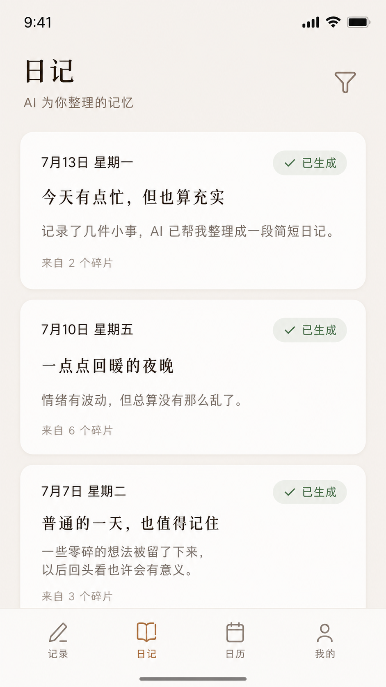
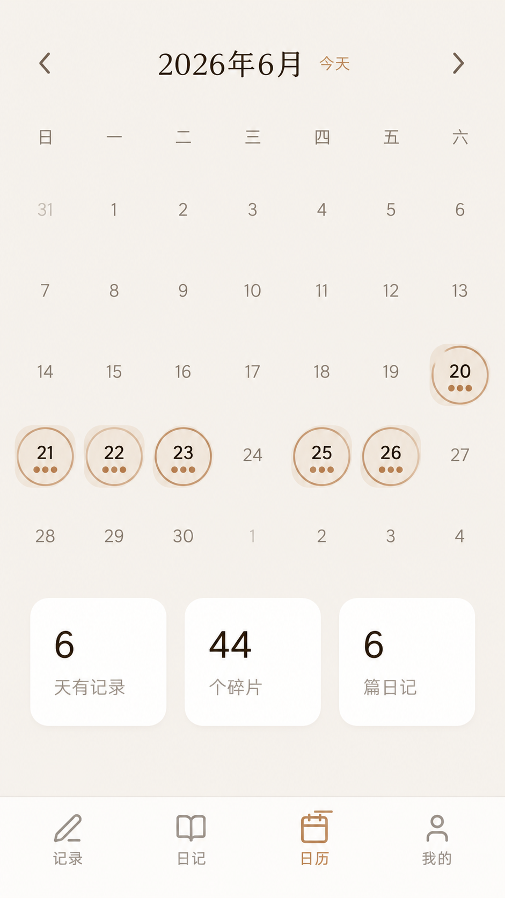
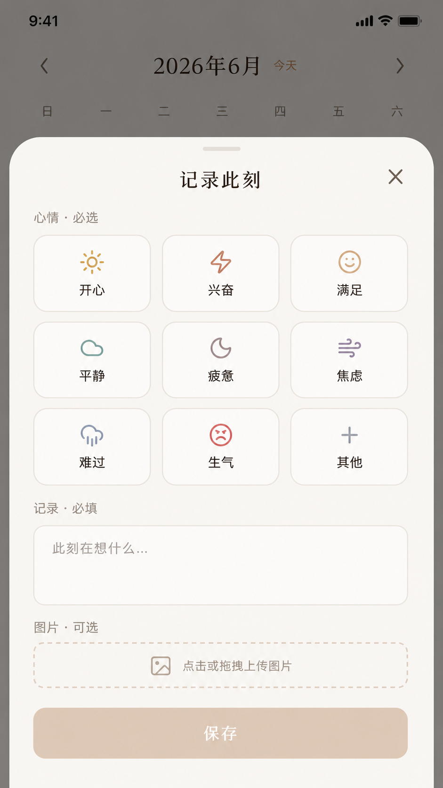
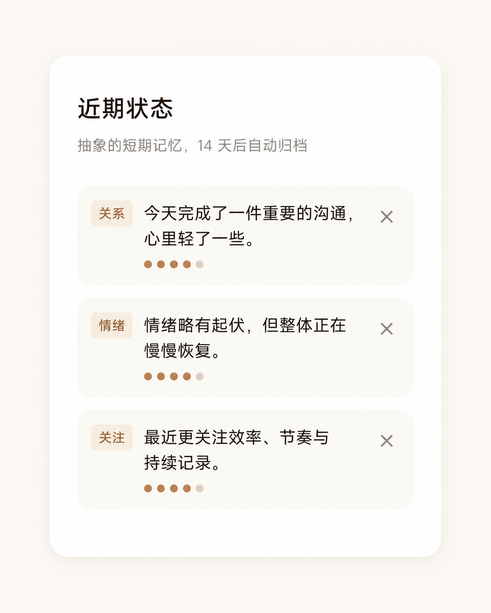

<div align="center">
  
  <h1>晚记 Night Journal</h1>
  <p><strong>白天丢碎片，夜里成日记。</strong></p>
  <p><strong>Drop fragments by day. Wake up to a diary by night.</strong></p>

  <p>
    <a href="#screenshots">
      
    </a>
    
    
    
    
  </p>

  <p>
    <a href="#简体中文">简体中文</a> ·
    <a href="#english">English</a> ·
    <a href="./AGENTS.md">AGENTS.md</a> ·
    <a href="./CONTRIBUTING.md">CONTRIBUTING</a>
  </p>
</div>

---

<div id="screenshots" align="center">
  
  &nbsp;&nbsp;
  
  &nbsp;&nbsp;
  
  &nbsp;&nbsp;
  
</div>

<p align="center">
  日记列表 · 日历视图 · 情绪记录 · 近期状态
</p>

---

<a id="简体中文"></a>

## 简体中文

### 这是什么？

**晚记** 是一款面向移动端的私人日记应用。它不做传统的“长文日记”，而是让你用碎片化的方式记录一天：一句话、一张照片、一种情绪。夜间，AI 会自动把这些碎片整理成一篇完整的日记，并保留你的人格画像与短期记忆，让下一篇日记更懂你。

### 核心特性

| 特性 | 说明 |
|---|---|
| 碎片记录 | 文字 + 情绪 + 图片，随时随地丢一个碎片 |
| 夜间成文 | AI 自动聚合碎片，生成连贯、私人的日记 |
| 记忆机制 | 人格画像 + 14 天短期记忆，日记越写越像“你写的” |
| 日历视图 | 一眼看到哪些日子有记录、有日记 |
| 安全认证 | 账号密码登录（bcrypt cost=12），统一 JWT session |
| PWA 安装 | 支持 Chrome / Edge / Safari 安装为桌面/主屏应用 |
| 一键部署 | `docker compose up -d --build` 即完成，自动迁移 |

### 服务器部署（推荐）

> 当前架构依赖 MySQL、本地文件存储和定时任务，**最推荐的方式是部署到一台长期运行的服务器或 VPS**，使用 Docker Compose 一键拉起全部服务。

```bash
# 1. 复制环境变量模板
cp .env.example .env

# 2. 填写 APP_SECRET（至少 32 位随机字符串）
#    openssl rand -hex 32
#    DATABASE_URL 使用 Docker Compose 默认值即可

# 3. 构建并启动
docker compose up -d --build

# 4. 打开浏览器
open http://localhost:3000
```

容器启动时会自动执行 `drizzle-kit push` 完成数据库建表，无需手动迁移。

### 安装为 PWA

晚记已配置 PWA：manifest、`apple-touch-icon`、主题色、启动图标（192x192 / 512x512）都已就位。部署到支持 HTTPS 的域名后，可直接安装成原生应用一样的独立窗口。

| 浏览器 / 平台 | 安装方式 |
|---|---|
| **Chrome / Edge（桌面/安卓）** | 地址栏右侧或菜单中选择「安装 晚记」/「安装应用」 |
| **Safari（iOS）** | 分享按钮 →「添加到主屏幕」 |
| **Safari（macOS Sonoma+）** | 菜单栏「文件」→「添加到程序坞」 |

> 如果 Chrome 没有自动弹出安装提示，可通过浏览器菜单 ⋮ →「保存并分享」→「安装页面为应用」手动安装。

### 本地开发

```bash
npm install
cp .env.example .env

# 推送数据库 schema
npm run db:push

# 启动前后端（Vite HMR + Hono hot-reload）
npm run dev
```

常用命令：

| 命令 | 作用 |
|---|---|
| `npm run dev` | 启动前后端开发服务器 |
| `npm run build` | 生产构建（输出到 `dist/`） |
| `npm run check` | TypeScript 类型检查 |
| `npm test` | 运行 vitest 单元测试 |
| `npm run db:push` | 推送 schema 到数据库 |
| `npm run db:studio` | Drizzle Studio 可视化数据库 |

### 技术栈

| 层 | 技术 |
|---|---|
| 前端 | React 19, React Router v7, TanStack Query, Framer Motion, Tailwind CSS, shadcn/ui |
| 后端 | Hono, tRPC v11, Drizzle ORM |
| 数据库 | MySQL 8.4 |
| 认证 | 账号密码（bcrypt），统一 JWT session (HS256, 30天) |
| 构建 | Vite + esbuild |

### 环境变量

详见 [.env.example](./.env.example)。

| 变量 | 必填 | 说明 |
|---|---|---|
| `APP_SECRET` | ✅ | JWT 签名密钥，至少 32 位随机字符串 |
| `DATABASE_URL` | ✅ | MySQL 连接串（Compose 内置 MySQL 时可用默认值） |
| `OWNER_UNION_ID` | 可选 | 管理员 union_id（本地账号格式 `local:<username>`） |
| `PORT` | 可选 | 监听端口，默认 3000 |
| `ENABLE_AUTO_GENERATION_IN_DEV` | 可选 | 设为 `true` 时在开发模式下启用自动日记生成调度器 |

### 测试

```bash
npm test
```

单元测试覆盖账号密码注册/登录、JWT 签发/验证、环境变量校验、日记/碎片路由、Dream 记忆响应解析等。

### 路线图

- [x] 账号密码注册 / 登录
- [x] 今日碎片记录（文字 + 情绪）
- [x] 日记列表 / 详情 / 删除
- [x] AI 日记生成（手动 + 自动调度）
- [x] Dream 记忆机制（人格画像 + 短期记忆）
- [x] API key 加密存储（AES-256-GCM）
- [x] Docker 一键部署（自动迁移）
- [ ] 图片上传持久化（待接入 OSS/S3）

### 参与贡献

请阅读 [CONTRIBUTING.md](./CONTRIBUTING.md) 了解分支、commit、PR 规范。

### 安全

发现安全问题请查看 [SECURITY.md](./SECURITY.md)。

### 许可证

[Apache-2.0](./LICENSE)

---

<a id="english"></a>

## English

### What is this?

**Night Journal** is a mobile-first private diary app. Instead of asking you to write long-form entries, it captures your day as scattered fragments: a sentence, a photo, a mood. At night, AI composes those fragments into a coherent diary entry and remembers your personality and recent state so the next entry feels even more like you.

### Core Features

| Feature | Description |
|---|---|
| Fragment capture | Text, mood, and photo fragments dropped anytime |
| AI composition | AI turns fragments into a coherent diary entry at night |
| Memory layer | Personality profile + 14-day short-term memory for continuity |
| Calendar view | See at a glance which days have records and diaries |
| Secure auth | Username/password login with bcrypt cost=12, unified JWT session |
| PWA install | Install as desktop/home-screen app on Chrome / Edge / Safari |
| One-command deploy | `docker compose up -d --build` with automatic migrations |

### Server Deployment (Recommended)

> The current architecture depends on MySQL, local file storage, and scheduled tasks. **We recommend deploying to a long-running server or VPS** and starting everything with Docker Compose.

```bash
# 1. Copy environment template
cp .env.example .env

# 2. Fill in APP_SECRET (at least 32 random chars)
#    openssl rand -hex 32
#    DATABASE_URL can use the Docker Compose default

# 3. Build and start
docker compose up -d --build

# 4. Open in browser
open http://localhost:3000
```

The container automatically runs `drizzle-kit push` on startup, so no manual migration is needed.

### Install as PWA

Night Journal is PWA-ready: the manifest, `apple-touch-icon`, theme color, and launch icons (192x192 / 512x512) are all in place. Once deployed behind HTTPS, users can install it as a standalone app on desktop and mobile.

| Browser / Platform | How to install |
|---|---|
| **Chrome / Edge (desktop / Android)** | Choose "Install Night Journal" from the address bar or browser menu |
| **Safari (iOS)** | Tap Share → "Add to Home Screen" |
| **Safari (macOS Sonoma+)** | File → "Add to Dock" |

> If Chrome does not show the install prompt automatically, use the browser menu ⋮ → "Save and share" → "Install page as app".

### Local Development

```bash
npm install
cp .env.example .env

# Push database schema
npm run db:push

# Start frontend + backend (Vite HMR + Hono hot-reload)
npm run dev
```

Common commands:

| Command | Purpose |
|---|---|
| `npm run dev` | Start dev server for both frontend and backend |
| `npm run build` | Production build (output to `dist/`) |
| `npm run check` | TypeScript type check |
| `npm test` | Run vitest unit tests |
| `npm run db:push` | Push schema to database |
| `npm run db:studio` | Drizzle Studio database UI |

### Tech Stack

| Layer | Tech |
|---|---|
| Frontend | React 19, React Router v7, TanStack Query, Framer Motion, Tailwind CSS, shadcn/ui |
| Backend | Hono, tRPC v11, Drizzle ORM |
| Database | MySQL 8.4 |
| Auth | Username/password (bcrypt), unified JWT session (HS256, 30 days) |
| Build | Vite + esbuild |

### Environment Variables

See [.env.example](./.env.example) for the full template.

| Variable | Required | Description |
|---|---|---|
| `APP_SECRET` | ✅ | JWT signing secret, at least 32 random characters |
| `DATABASE_URL` | ✅ | MySQL connection string (default works with Compose MySQL) |
| `OWNER_UNION_ID` | Optional | Admin union_id (local format: `local:<username>`) |
| `PORT` | Optional | Server port, defaults to 3000 |
| `ENABLE_AUTO_GENERATION_IN_DEV` | Optional | Set to `true` to enable auto diary generation scheduler in dev |

### Testing

```bash
npm test
```

Unit tests cover username/password registration/login, JWT sign/verify, env validation, diary/entry routes, and Dream memory response parsing.

### Roadmap

- [x] Username/password registration & login
- [x] Daily fragment capture (text + mood)
- [x] Diary list / detail / delete
- [x] AI diary generation (manual + scheduled)
- [x] Dream memory layer (personality profile + short-term memory)
- [x] API key encrypted storage (AES-256-GCM)
- [x] Docker one-command deploy with automatic migrations
- [ ] Image upload persistence (OSS/S3 integration pending)

### Contributing

Please read [CONTRIBUTING.md](./CONTRIBUTING.md) for branch, commit, and PR conventions.

### Security

See [SECURITY.md](./SECURITY.md) for security policies and reporting.

### License

[Apache-2.0](./LICENSE)
